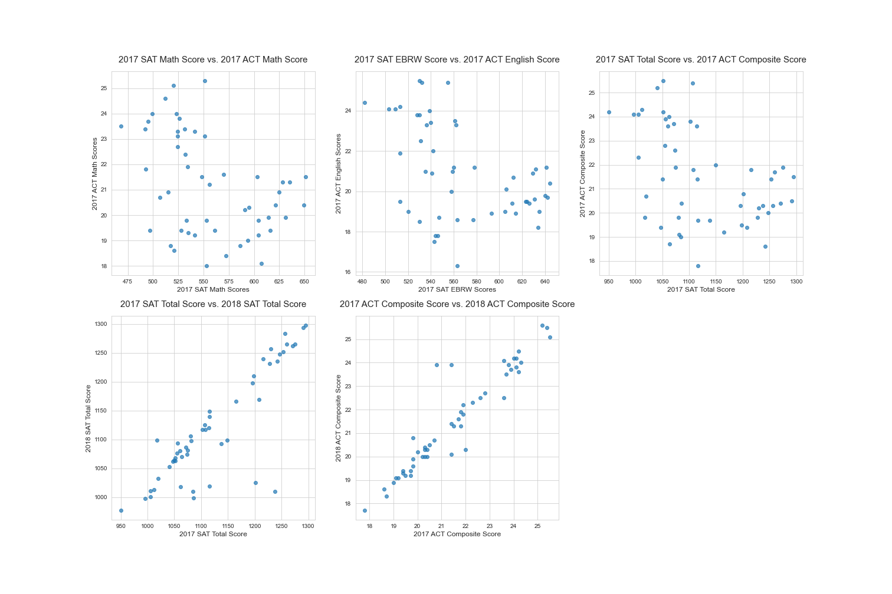

# Executive Summary

## 1. Problem statement

**What states are most likely to increase their level of participation in the SAT next year?**

---

## 2. Description of Data

#### Original data:

|         | act_2017 | act_2018 | act_2019 | sat_2017 | sat_2018 | sat_2019 | final    |
|---|----------|----------|----------|----------|----------|----------|----------|
|**Shape**| (51, 7)  | (51, 3)  | (52, 3)  | (51, 5)  | (51, 5)  | (53, 5)  | (51, 23) |

As you can see, our data was comprised of 7 datasets, and `act_2019` and `sat_2019` both had some extra rows. We needed to clean those up. The final, merged data consisted of **51 columns and 23 features**

#### Data Sources:

* [SAT Source 1](https://blog.collegevine.com/here-are-the-average-sat-scores-by-state/)
* [SAT Source 2](https://blog.prepscholar.com/average-sat-scores-by-state-most-recent)
* [ACT Source](https://blog.prepscholar.com/act-scores-by-state-averages-highs-and-lows)

#### Data Dictionary:

|Feature|Type|Dataset|Description|
|---|---|---|---|
|**state**|*object*|sat_2017|The state within the United States| 
|**participation_sat_2017**|*float*|sat_2017|Percentage of students who took the SAT exam in 2017, represented in decimals 0-1|
|**participation_sat_2018**|*float*|sat_2018|Percentage of students who took the SAT exam in 2018, represented in decimals 0-1|
|**participation_sat_2019**|*float*|sat_2019|Percentage of students who took the SAT exam in 2019, represented in decimals 0-1|
|**ebrw_sat_2017**|*integer*|sat_2017|The average score for the Evidence-based Reading and Writing portion of the SAT exam in 2017. The minimum possible score is 200, the maximum is 800|
|**ebrw_sat_2018**|*integer*|sat_2018|The average score for the Evidence-based Reading and Writing portion of the SAT exam in 2018. The minimum possible score is 200, the maximum is 800|
|**ebrw_sat_2019**|*integer*|sat_2019|The average score for the Evidence-based Reading and Writing portion of the SAT exam in 2019. The minimum possible score is 200, the maximum is 800|
|**math_sat_2017**|*integer*|sat_2017|The average score for the Math portion of the SAT exam in 2017. The minimum possible score is 200, the maximum is 800|
|**math_sat_2018**|*integer*|sat_2018|The average score for the Math portion of the SAT exam in 2018. The minimum possible score is 200, the maximum is 800|
|**math_sat_2019**|*integer*|sat_2019|The average score for the Math portion of the SAT exam in 2019. The minimum possible score is 200, the maximum is 800|
|**total_sat_2017**|*integer*|sat_2017|The total of the averages of both portions of the SAT exam in 2017. The minimum possible score is 400, the maximum is 1600|
|**total_sat_2018**|*integer*|sat_2018|The total of the averages of both portions of the SAT exam in 2018. The minimum possible score is 400, the maximum is 1600|
|**total_sat_2019**|*integer*|sat_2019|The total of the averages of both portions of the SAT exam in 2019. The minimum possible score is 400, the maximum is 1600|
|**participation_act_2017**|*float*|act_2017|Percentage of students who took the ACT exam in 2017. The minimum possible score is 1, the maximum possible score is 36|
|**participation_act_2018**|*float*|act_2018|Percentage of students who took the ACT exam in 2018. The minimum possible score is 1, the maximum possible score is 36|
|**participation_act_2019**|*float*|act_2019|Percentage of students who took the ACT exam in 2019. The minimum possible score is 1, the maximum possible score is 36|
|**english_act_2017**|*float*|act_2017|The average score for the English portion of the ACT exam in 2017. The minimum possible score is 1, maximum is 36|
|**english_act_2018**|*float*|act_2018|The average score for the English portion of the ACT exam in 2018. The minimum possible score is 1, maximum is 36|
|**english_act_2019**|*float*|act_2019|The average score for the English portion of the ACT exam in 2019. The minimum possible score is 1, maximum is 36|
|**math_act_2017**|*float*|act_2017|The average score for the Math portion of the ACT exam in 2017.  The minimum possible is 1, maximum possible is 36|
|**reading_act_2017**|*float*|act_2017|The average score for the Reading portion of the ACT exam in 2017. The minimum possible score is 1, maximum is 36|
|**science_act_2017**|*float*|act_2017|The average score for the Science portion of the ACT exam in 2017. The minimum possible score is 1, maximum is 36|
|**composite_act_2017**|*float*|act_2017|The average of the scores from all the portions of the ACT exam in 2017. The minimum possible score is 1, maximum is 36|
|**composite_act_2018**|*float*|act_2018|The average of the scores from all the portions of the ACT exam in 2018. The minimum possible score is 1, maximum is 36|
|**composite_act_2019**|*float*|act_2019|The average of the scores from all the portions of the ACT exam in 2019. The minimum possible score is 1, maximum is 36|

### Exploratory Data Visualizations:

[/]: <> (Thank you to Magnus on stack overflow for showing me how to comment: https://stackoverflow.com/questions/4823468/comments-in-markdown)

[/]: <> (And thank you to zjffdu for showing me how to display local images: https://stackoverflow.com/questions/41604263/how-to-display-local-image-in-markdown)

---

## 3. Primary findings and conclusions

### From the Data
* The participation rate for the SATs is increasing, and the particiation rate for the ACTs is decreasing
* Our data shows an inverse correlation between participation and total/composite score across both the SAT and ACT.
* There is no strong correlation between SAT total score and ACT total score. Doing well on one does not mean doing well on the other. This can be interpreted to mean that the **SAT and ACT are testing for different things**
 * This is good to keep in mind, see "Further Research"
* Three states have defected from the ACT between 2017-2019: **Illinois, Colorado, and West Virginia**

### Why did some states switch to SAT?

#### Illinois
    
* SAT is better aligned with standards for what students should know in Illinois   
    *Source: [Chicago Tribune](https://www.chicagotribune.com/news/ct-illinois-chooses-sat-met-20160211-story.html)* #Thank you zjffdu from Stack Overflow! https://stackoverflow.com/questions/41604263/how-to-display-local-image-in-markdown
* Connected to their school rating system, accounts for "20% of a school's rating in achievement and growth" (Elaine Chen, "Illinois has embraced the SAT, and the ACT is mad about it"  
    *Source: [Elaine Chen, Illinois has Embraced the SAT and the ACT is mad about it](https://chicago.chalkbeat.org/2018/7/27/21105418/illinois-has-embraced-the-sat-and-the-act-is-mad-about-it)*

#### Colorado

- SAT aligns with **Common Core standards** in English and math  
- SAT measures the skills and knowledge that evidence shows is critical for **college and career readiness**  
- Partnership with Khan Academy to provide **free test prep**  
- Commitment to the **Student Data Privacy Pledge**  

    *Source: ["Colorado's Switch from ACT to SAT"](https://www.coloradokids.org/wp-content/uploads/2016/01/ACTvsSAT_FINAL.pdf)*

#### West Virginia

* SAT is **cheaper** than ACT  
* "Abundance of **student and teacher resources"**
* Reputation as a **respected assessment**
* Acceptance of SAT at all institutions of higher learning  

    *Source: [Blaine Carragher, Dalton Hammonds, "UPDATE: W.Va. high school juniors now required to take SAT exam."](https://www.wsaz.com/content/news/All-WVa-high-school-juniors-to-begin-taking-SAT-exam-beginning-Spring-2018-444248263.html)
    
---
    
## 4. Next Steps

* **Update your selling points** to reflect reasearch-driven feedback
 * SAT and ACT are entirely different tests and measure different things. 
 * SAT measures more relevant skills related to college and career readiness
 * SAT aligns with Common Core Standards
 * SAT is cheaper than the ACT and provides resources to students and teachers through partnerships with Khan Academy
 
* Pursue states where **ACT contracts are expiring**
 * We have had success in Illinois, Colorado, and West Virginia when the ACTs contract proposals are compared side-by-side with ours
 * If we can identify when those contracts are up, we can get started on preparing proposals

* **Expand to the West Coast**, potentially California
 * California is currently split between ACT and SAT, favoring SAT
 * California [Department of Education homepage](https://www.cde.ca.gov/) shows a focus on the selling points noted in the previous slide
 * Getting California to commit to an exclusive contract could help us get a foothold in the west coast. Oregon and Washington are showing similar trends
