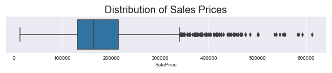
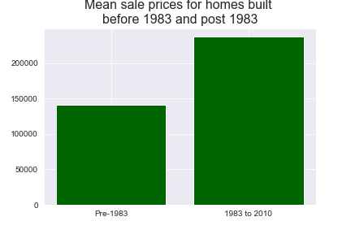
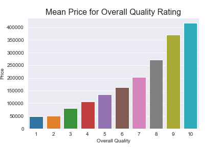

## Problem Statement

Can a linear regression model trained on home price sales from 2006-2010 in Ames, IA perform better than a baseline model for predicting unknown home prices? What is the correlation between the features of a home and the sale price? How can investors and homeowners use this information to help increase the value of their homes?

## Description of Data ([Pulled from the Documentation](http://jse.amstat.org/v19n3/decock/DataDocumentation.txt))
* Dataset contains features of homes sold in Ames, IA between 2006 and 2010
* SIZE: 
 * Training set: 2051 observations, 81 variables
 * Testing set: 878 observations, 80 variables (missing `Sale Price`)
* TARGET: Regression model to predict sale price
* DATA DICTIONARY: original 82 variables accounted for in the [source data](http://jse.amstat.org/v19n3/decock/DataDocumentation.txt)

## Project Directory

```
project-2
|__ code
|   |__ 01_EDA.ipynb   
|   |__ 02_cleaning_engineering.ipynb   
|   |__ 03_feature_inspection.ipynb
|   |__ 04_lasso_model.ipynb  
|   |__ 05_ridgecv_model.ipynb
|   |__ 06_multiple_linear_model.ipynb   
|   |__ 07_conclusions.ipynb
|__ datasets
|   |__ cleaned
|   |   |__ houses_test_clean.csv
|   |   |__ houses_train_clean.csv
|   |__ coefs
|   |   |__ lasso_coefs.csv
|   |   |__ lr_coefs.csv
|   |   |__ ridge_coefs.csv
|   |   |__ scaled_lr_coefs.csv
|   |__ train.csv
|   |__ test.csv
|__ images
|   |__ age_of_garage_and_home_pairplot.png
|   |__ coefs_lasso_reg.png
|   |__ coefs_ridge_reg.png
|   |__ home_price_pre_post_1983.png
|   |__ mean_price_overall_quality.png
|   |__ sales_price_boxplot.png
|__ submissions
|   |__ test53_lasso.csv
|   |__ test66_lasso.csv
|   |__ test67ridgeCV.csv
|   |__ test69_linreg.csv
|__ Ames-Housing-presentation.pdf
|__ Ames-Housing-presentation.pptm
|__ README.md
```





## Model Performance on Training/test data

|            | **RMSE Score on Test Data (20% of original dataset)** | **RMSE Score on Kaggle Data** |
|------------|-----------------------------------------------------------|-------------------------------|
| **LinReg** |                 <center>17265.16</center>                 | <center>21166.21</center>     |
| **Ridge**  |                 <center>18031.37</center>                 | <center>21820.68</center>     |
| **Lasso**  |                 <center>18074.75</center>                 | <center>21619.87</center>     |

I chose the Linear Regression model for production because it had the smallest difference between the Test data and the unknown data.

## Primary Findings/Conclusions/Recommendations

|      **Feature Name**  |     **Coefficient (in dollars)**    |
|:----------------------:|:-----------------------------------:|
|     Kitchen Qual_TA    |                     -17353.52449    |
|     Kitchen Qual_Gd    |                     -16072.64169    |
|       Bsmt Qual_Gd     |                     -11528.71693    |
|      Total Bsmt SF     |                        19.312078    |
|       BsmtFin SF 1     |                        21.700437    |

After running all the tests on the data, I've come to the following conclusions about the **best ways to improve a home's value**:
* **Remodel your kitchen!** When compared to a kitchen of Excellent quality, a good to poor kitchen may negatively impact your house value by 16,000 dollars when all other variables are equal.
* **Remodel your basement!** When compared to basements of Excellent quality, a Good to poor basement may negatively impact your house value by around $21 per sf when all other variables are held constant


And some conclusions about the models I ran:
* The Lasso model seemed to perform the most consistently, though the many interaction terms made the results difficult to interpret literally.
* A simpler model with less features would sacrifice accuracy for the sake of a clearer, actionable understanding of the correlation between features and sale price.

## Next Steps

* Take a step back and reduce the number of features in the model in order to use the Linear Regression model in a way that is easily interpretable. A few interaction terms were removed from my conclusion visualizations because they were difficult to make recommendations with.
* The model is almost ready for production, after running over 60 tests on Kaggle, I have a good sense of what will make the model better/worse.
* I'm looking forward to starting fresh with a clean notebook, since many of the skills I applied to this model were skills I was learning while doing the project.

## Sources

* Dataset: http://jse.amstat.org/v19n3/decock/DataDocumentation.txt
* Imputing data: https://towardsdatascience.com/6-different-ways-to-compensate-for-missing-values-data-imputation-with-examples-6022d9ca0779
* Extracting p-values from OLS Summary: https://stackoverflow.com/questions/37508158/how-to-extract-a-particular-value-from-the-ols-summary-in-pandas/41212509

## Special Thanks

Thank you to my instructors Adi Brohnstein, Patrick Wales-Dinan, Kelly Slatery, Noah Christiansen, and Jacob Ellena for sharing insights and knowledge throughout the course.

Thank you to my study group for the late nights, good laughs, and support throughout the project! David Lee, Jenny James, James Pecore, Chris Johnson, Lydia Kajeckas, Aidan Curley, Haley Taft, Dana Hackel, Amanda Fry, Zakaria Zerhouni, Caleb Stephenson, and Josh Mizraji!