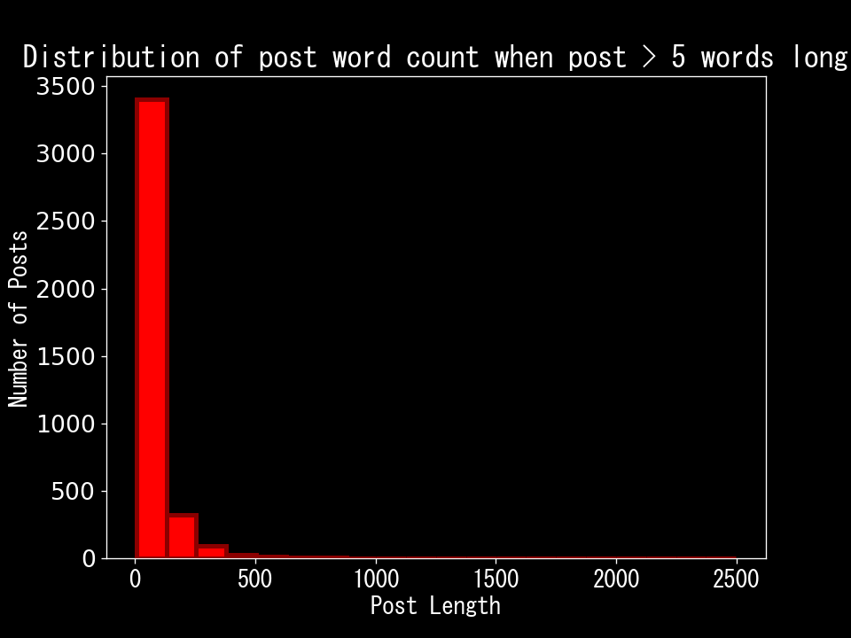
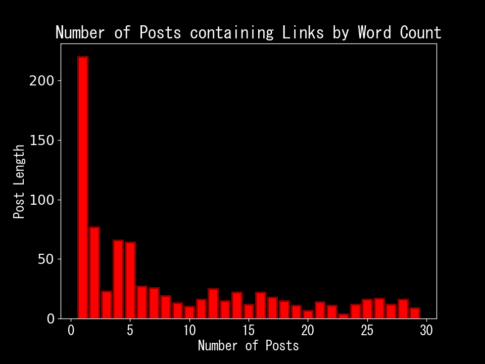
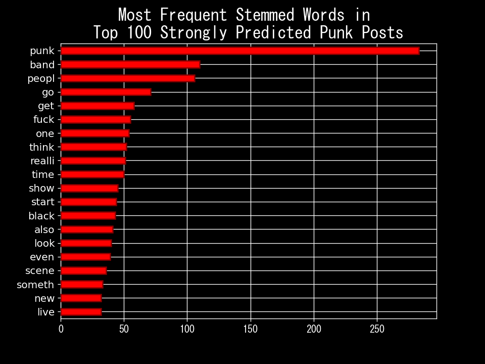
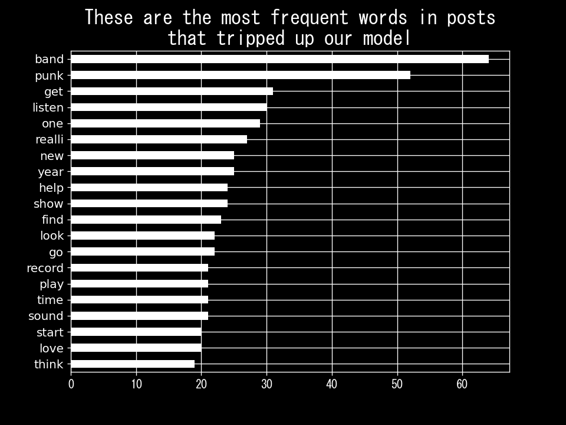

# Reddit Classification Project Executive Summary

In this project, we're going to be looking for a model that classifies different subreddits based on the content of posts within the subreddit.

## Problem Statement

Is the language in text posts from the subreddits of **Punk** and **PopPunkers** different enough that a classification model can predict which subreddit a post belongs to with an accuracy higher than the baseline?

To answer this question, we'll test multiple models using `GridSearchCV` to iterate through models with different parameters we've identified as being important to the success of our model. 

## Data Description

### Size of our Data
* 5000 posts with 79 features per post
  * 2500 from subreddit r/Punk
  * 2500 from subreddit r/PopPunk

### Data Source

Our data was scraped from posts made on the following subreddits using the [PushShift API](https://github.com/pushshift/api):
* https://reddit.com/r/Punk
* https://reddit.com/r/PopPunkers

### Data Target

We're trying to **classify** the **subreddit** that a post came from

### Features Chosen

In the final model, we only referenced the `selftext` feature of the original dataset - this is the **body** of a post which typically contains more text than a post title.

### Exploratory Data Analysis Visualizations

## Model Performance on Training/Test Data

I experimented with the following models:
* Logistic Regression
* Multinomial Naive Bayes
* Support Vector Classifier

And the following transformers:
* Count Vectorizer
* TF-IDF Vectorizer

And GridSearched extensively over the following parameters:

| Feature Name         | Description                                                                                                                   |
|:----------------------|:-------------------------------------------------------------------------------------------------------------------------------|
| `max_df`             | Maximum document frequency, if value is a float,  ignores features present in a proportion of the  documents above this value |
| `min_df`             | Minimum document frequency, if value is a float, ignores features present in a proportion of the  documents below this value  |
| `ngram_range`        | Tuple representing the range of n-grams to split a document into                                                              |
| `stop_words`         | A list of words that will be ignored by the vectorizer                                                                        |
| `max_features`       | The max amount of features our vectorizer will return, priority given to the most  frequently encountered features            |
| `C`                  | For the SVC model only - a regularization parameter. Strength of regularization is inversely proportional to the value of C   |
| `cvec__` or `tvec__` | Suffixes for parameters, stand for CountVectorizer() and TfidfVectorizer()                                                    |

### GridSearchCV Results

| Test Number | cvec__max_df | cvec__max_features | cvec__min_df | cvec__ngram_range | cvec__stop_words | vectorizer                                   | model                             | train_score | test_score  | svc__C   | tvec__max_df | tvec__max_features | tvec__min_df | tvec__ngram_range |
|-------------|--------------|--------------------|--------------|-------------------|------------------|----------------------------------------------|-----------------------------------|-------------|-------------|----------|--------------|--------------------|--------------|-------------------|
| 1           | 0.95         | 4000               | 0.001        | (1, 2)            | custom_sw        | CountVectorizer(tokenizer=tokenize_and_stem) | LogisticRegression(max_iter=2000) | 0.788779028 | 0.830721003 |          |              |                    |              |                   |
| 3           | 0.99         | 4000               | 0            | (1, 2)            | custom_sw        | CountVectorizer(tokenizer=tokenize_and_stem) | LogisticRegression(max_iter=2000) | 0.787733124 | 0.831765935 |          |              |                    |              |                   |
| 5           | 0.8          | 4000               | 0            | (1, 2)            | custom_sw        | CountVectorizer(tokenizer=tokenize_and_stem) | LogisticRegression(max_iter=2000) | 0.787733124 | 0.831765935 |          |              |                    |              |                   |
| 2           | 0.99         | 4000               | 0            | (1, 2)            | custom_sw        | CountVectorizer(tokenizer=tokenize_and_stem) | MultinomialNB()                   | 0.812131273 | 0.832810867 |          |              |                    |              |                   |
| 4           | 0.8          | 4000               | 0            | (1, 2)            | custom_sw        | CountVectorizer(tokenizer=tokenize_and_stem) | MultinomialNB()                   | 0.812131273 | 0.832810867 |          |              |                    |              |                   |
| 0           | 0.95         | 4000               | 0.001        | (1, 2)            | custom_sw        | CountVectorizer(tokenizer=tokenize_and_stem) | MultinomialNB()                   | 0.811782841 | 0.834900731 |          |              |                    |              |                   |
| 6           |              |                    |              |                   |                  | TfidfVectorizer()                            | SVC(degree=2, kernel='poly')      | 0.79330074  | 0.807732497 | 0.789495 | 0.95         | 4000               | 0.002        | (1, 1)            |
| 7           |              |                    |              |                   |                  | TfidfVectorizer()                            | SVC(degree=2, kernel='poly')      | 0.79330074  | 0.807732497 | 0.789495 | 0.99         | 4000               | 0.002        | (1, 1)            |
| 8           |              |                    |              |                   |                  | TfidfVectorizer()                            | SVC(degree=2, kernel='poly')      | 0.79330074  | 0.807732497 | 0.789495 | 0.8          | 4000               | 0.002        | (1, 1)            |

I chose to use Test Number 4, a `MultinomialNB()` model with the following parameters:

| Parameter           | Value
|:--------------------|:----------------------------------------------|
| `cvec__max_df`       | 0.8   
| `cvec__max_features` | 4000                                         |
| `cvec__min_df`       | 0                                            |
| `cvec__ngram_range`  | (1, 2)                                       |
| `cvec__stop_words`   | custom_sw                                    |
| vectorizer         | CountVectorizer(tokenizer=tokenize_and_stem) |
| model              | MultinomialNB()                              |

### Model Performance

This MultinomialNB() model had the following accuracy:
* **Training Data**: ~81.2%
* **Testing Data** : ~83.3%

For comparison, our **baseline model** to has an accuracy of ~50%, so the model we built **outperforms the baseline** model, predicting the origin of a post ~33.3% better than the baseline.

### Digging deeper into our predictions

We can't make any strong conclusions about the words here, but it is interesting to see that there aren't many band names in the top 20 for each category, except for *maybe* Black Flag in the `Punk` Subreddit, but there seem to be a mix of posts about black flag **AND** posts about the Black Lives Matter movement. 

Something interesting to note is that **'love' and 'friend'** pop up frequently in the posts that had the highest predictions of being in the `PopPunkers` subreddit, wheras those words are not to be found in the top 20 words in the `Punk` subreddit. 

Looking at this visual compared to the ones above, we can conclude there are quite a few words that intersect between the subreddits. Specifically **'punk' and 'band'**

## Final Conclusions

* The subreddits PopPunkers and Punk aren't completely separate groups, there is some overlap between them that trips up our Multinomial Naive Bayes model. Most notably, the words 'punk' and 'band' seem to be used regularly in both subreddits.
* The model outperforms the baseline model by ~33%, so this model could be useful for **marketing and messaging** purposes if further exploration and analysis is conducted on the **topics and words most commonly used** in each subreddit.

## Next Steps

* I'd like see how accurate the model was at predicting subreddits when the most important words are present.
 * I could reference posts containing each word and determine whether they were predicted correctly or not and store that in the `sorted_proba` dataframe
* Potentially removing words that seemed to trip up the model to improve accuracy rate
* Add the list of 'blacklisted bands' from the Punk subreddit and see if that improves accuracy
* Run model on different subreddits
* Run model on more than two subreddits